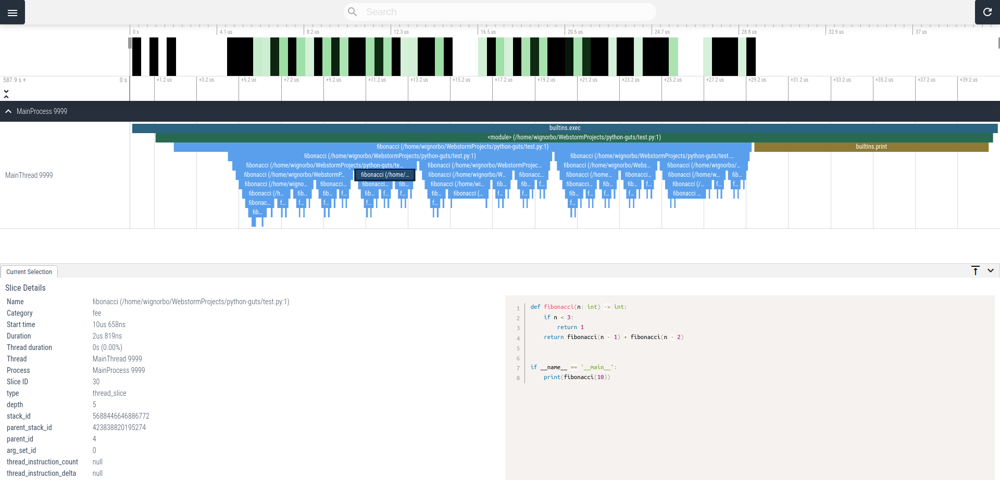
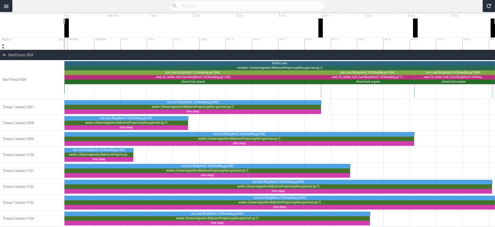
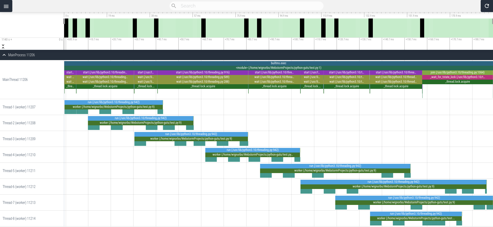
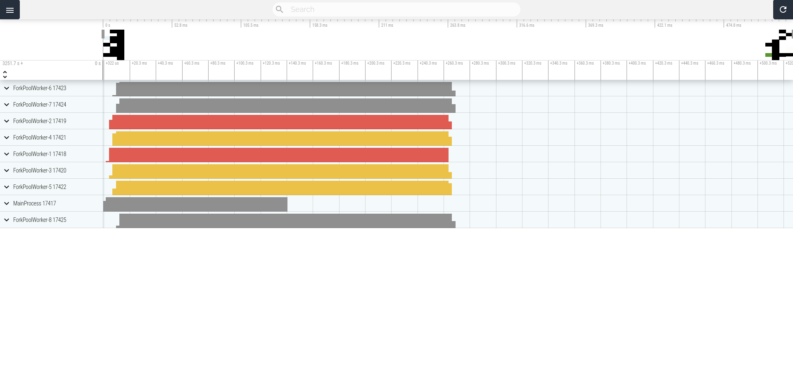
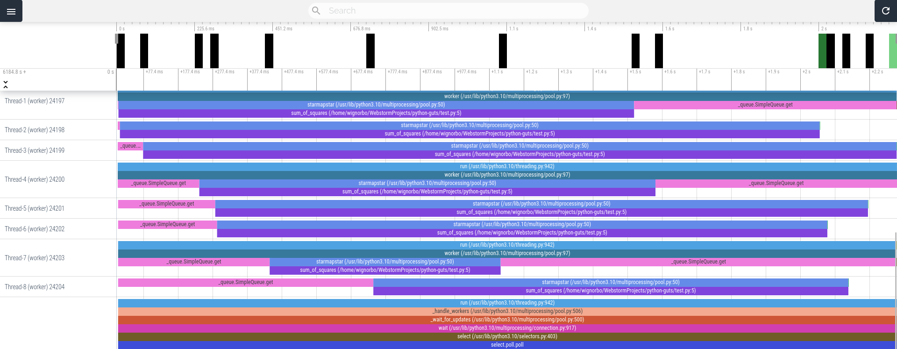

---
tags:
  - Профилирование
  - Производительность
  - Многопоточность
  - multiprocessing
  - threading
  - viztracer
---

# VizTracer

`VizTracer` - это инструмент для профилирования Python-программы.

Установка:

```shell
$ pip install viztracer
```

Запуск:

```shell
$ viztracer test.py
```

По окончании выполнения программы формируется отчет в формате JSON.

Визуализация:

```shell
$ vizviewer result.json
```

## Примеры

### Числа Фибоначчи. Рекурсия

```python
def fibonacci(n: int) -> int:
    if n < 3:
        return 1
    return fibonacci(n - 1) + fibonacci(n - 2)


if __name__ == '__main__':
    print(fibonacci(10))
```



На `FlameGraph`'е можно увидеть, сколько времени выполнялась функция - чем она длиннее на графике, тем дольше.

Для `n = 10` глубина рекурсии составила 9.

### threading

Посмотрим, как потоки себя ведут при решении CPU-bound и IO-bound задач.

#### IO-bound

```python
import random
import time

from threading import Thread


def worker():
    time.sleep(10 * random.random())


if __name__ == '__main__':
    threads = []
    for _ in range(8):
        threads.append(Thread(target=worker))
        threads[-1].start()

    for thread in threads:
        thread.join()
```



#### CPU-bound

```python
import random

from threading import Thread

result = 0


def worker():
    global result
    for _ in range(100_000):
        result += random.random()


if __name__ == '__main__':
    threads = []
    for _ in range(8):
        threads.append(Thread(target=worker))
        threads[-1].start()

    for thread in threads:
        thread.join()

    print(result)
```

```
194685.43393841566
```



Как можно заметить, `worker`'ы исполняются параллельно, но участки кода, связанные с доступом к переменной, работают последовательно благодаря GIL.

### multiprocessing

Посчитаем сумму квадратов целых чисел от 1 до 1,000,000 с помощью потоков и с помощью процессов.

#### Пул процессов

```python
from multiprocessing import Pool, cpu_count


def sum_of_squares(from_: int, to: int) -> int:
    result = 0
    for i in range(from_, to):
        result += i ** 2
    return result


def count_sum_of_squares(n: int, chunks: int = cpu_count()) -> int:
    step: int = n // chunks
    offset: int = 1
    ranges = [(step * i + offset, step * (i + 1) + offset)
              for i in range(chunks)]

    with Pool(chunks) as pool:
        results = pool.starmap(sum_of_squares, ranges)
    return sum(results)


if __name__ == '__main__':
    import time

    start = time.perf_counter()
    print(count_sum_of_squares(10_000_000))
    print(time.perf_counter() - start)
```

```
333333383333335000000
0.5275702479998472
```



#### Пул потоков

```python
from multiprocessing import cpu_count
from multiprocessing.pool import ThreadPool


def sum_of_squares(from_: int, to: int) -> int:
    result = 0
    for i in range(from_, to):
        result += i ** 2
    return result


def count_sum_of_squares(n: int, chunks: int = cpu_count()) -> int:
    step: int = n // chunks
    offset: int = 1
    ranges = [(step * i + offset, step * (i + 1) + offset)
              for i in range(chunks)]

    with ThreadPool(chunks) as pool:
        results = pool.starmap(sum_of_squares, ranges)
    return sum(results)


if __name__ == '__main__':
    import time

    start = time.perf_counter()
    print(count_sum_of_squares(10_000_000))
    print(time.perf_counter() - start)
```

```
333333383333335000000
2.2580976360000022
```



При получении такого результата я пришел в замешательство - всегда думал, что потоки работают последовательно при решении CPU-bound задач, а по графику можно видеть, что несколько `sum_of_squares` работают одновременно.

Оказалось, что реализация потоков в `multiprocessing` несколько иная, чем в `threading` - в первом они могут работать сразу на нескольких процессорах:

```shell
$ python3 test.py &
[1] 21592
$ ps -p 21592 -T -o pid,tid,psr,pcpu
    PID     TID PSR %CPU
  21592   21592   2  0.1
  21592   21593   7 13.7
  21592   21594   4  9.1
  21592   21595   0 19.5
  21592   21596   1 11.8
  21592   21597   5 13.7
  21592   21598   5 19.3
  21592   21599   1  8.4
  21592   21600   2  7.1
  21592   21601   1  0.0
  21592   21602   0  0.0
  21592   21603   1  0.0
```

## Ссылки
- [VizTracer. Документация](https://viztracer.readthedocs.io/en/latest/)
